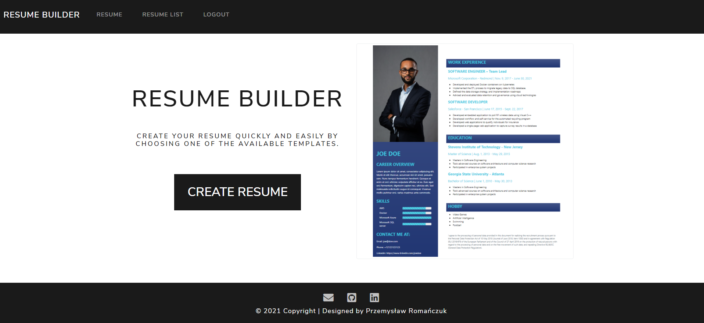

<div align="center">
<h1 align="center">Resume Builder</h1></div>



## Table of contents
* [General info](#general-info)
* [Technologies](#technologies)
* [Demo](#demo)
* [Setup & Installation](#setup-&-installation)
* [Running The App](#running-the-app)
* [Viewing The App](#viewing-the-app)
* [Features](#features)
* [Status](#status)
* [Contact](#contact)

## General info
**Resume Builder** is web application that allows you to quickly create a resume according to the template you selected.

## Technologies
* HTML5
* CSS3
* Bootstrap 5
* Python 3.9.x
* Django 3.2.x
* SQLite3

## Demo
Check app demo [here.](https://resume-builder-django.herokuapp.com/)

## Setup & Installation
Make sure you have the latest version of Python and pip installed

Clone the repository using the following command
```bash
git clone https://github.com/Gamattowicz/Resume_Builder.git
```
Create a virtual environment
```bash
python -m venv venv
```
Active the virtual environment
```bash
.\venv\Scripts\activate
```
Install all the project Requirements
```bash
pip install -r requirements.txt
```
Create an .env file to save your environment variables in /resume_builder directory, where <secret_key_name> is your sensitive data. \
<email_name> is the email you will use to send emails to users through the application and <email_password> is the password for it.
```bash
SECRET_KEY=<secret_key_name>
EMAIL_USER=<email_name>
EMAIL_PASSWORD=<email_password>
```
Create your database
```bash
python manage.py makemigrations
```
```bash
python manage.py migrate
```

## Running The App
```bash
python manage.py runserver
```

## Viewing The App
Go to `http://127.0.0.1:5000`

## Features
* User management system
* Creating resumes
* Adding photography
* CRUD functionality to each field of the resume 

**To Do:**
* Add tests
* Add option to download a resume

## Status 
Project in progress.

## Contact
Created by [@Gamattowicz](https://github.com/Gamattowicz) - feel free to contact me!